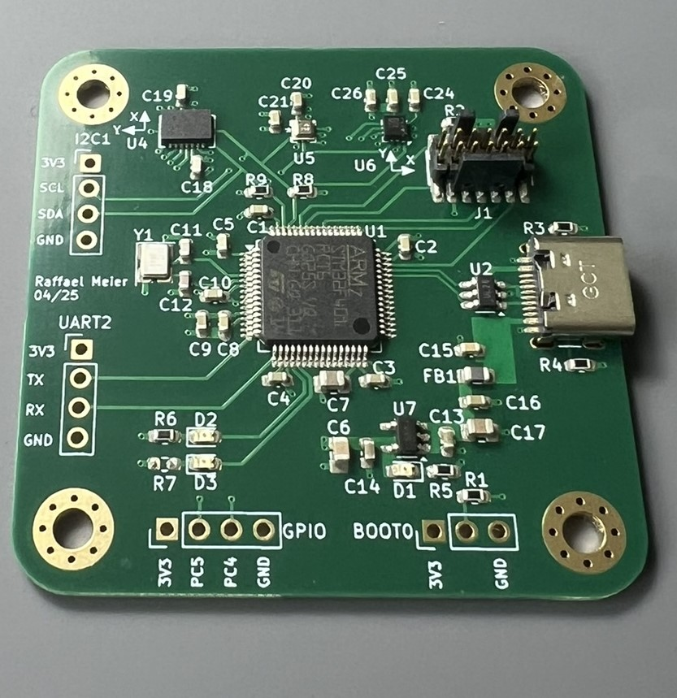
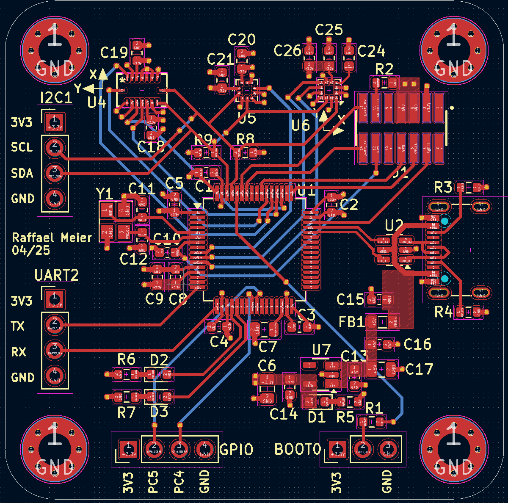

# Sensor Evaluation Board

## Overview

These are the KiCad files for a simple sensor evaluation board. It features an STM32F4 MCU, an IMU (BMI088), a magnetometer (LIS3MDLTR) and a barometer (BMP390). All sensors are connected to the same I2C interface on the microcontroller. The board is powered by the USB-C port and can be programmed via the SWD pins which are placed on the connector to interface with an ST-LINK V3MINIE (UART1 is routed to STLINK). Additionaly the STM32 could be programmed via the USB cable in DFU mode by setting the BOOT0 jumper to high. The board features some extra GPIO (e.g. the sensor I2C bus, UART2) headers and two controllable LEDs.

## Pictures

PCB after SMD soldering.

Layout of the PCB. Build-Up: SGN-GND-3V3-SGN

## BOM
- STM32F401RCT6 (1)
- BMI088 (1)
- LIS3MDLTR (1)
- BMP390 (1)
- 10p 0603 cap (2)
- 10n 0603 cap (1)
- 100n 0603 cap (14)
- 1u 0603 cap (4)
- 4.7u 0805 cap (2)
- 10u 0805 cap (1)
- Red SMD LED 0603 (3)
- Ferrite bead 600 ohm 0805 (e.g. HZ0805E601R-10) (1)
- 100 resistor 0603 (1)
- 510 resistor 0603 (3)
- 5.1k resistor (4)
- 10k resistor 0603 (1)
- USB-C USB2.0 receptacle (e.g. USB4105-GF-A) (1)
- FTSH-107-01-L-DV-KCONN HEADER SMD 14POS 1.27MM Samtec Inc. (1)
- USB TVS diode STMicroelectronics USBLC6-2SC6 (1)
- Linear regulator SOT23-5 (e.g. MIC5504-3.3YM5-TR) (1)
- 16MHz oscillator TSX-3225 16.0000MF09Z-AC0 (1)

